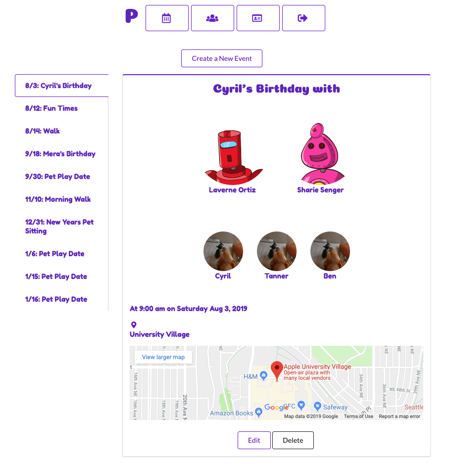

# PetConnect

React frontend of PetConnect, a social media app to connect with other pet owners and plan pet play dates!

## Demo

[Vimeo demo](https://vimeo.com/349003287)

## Installation
* If you would like to use this repo locally, it needs a backend, which you can find [here](https://github.com/Mera-Stackhouse/pet-connect-backend)
* Clone down this repo
* Links for the fetch requests are declared as constants with the \_URL suffix at the top of components under all import statements. Please change these to connect to the port the API backend is using.
* Start the server with ```npm start```

## Features of PetConnect
* Log in with your Google account using OAuth. If you have never logged in before, a new PetConnect account will be created for you.
* View and edit your profile.
* Add, edit, and remove your pets.
* Set up events with your fellow pet owners, including choosing the participating pets and the location.

## Technologies
* OAuth using OAuth.io
* Semantic UI
* Google Maps Embed API

## Credits

* Joe Yang, for CSS tips
* Thank you to the following Stack Overflows and docs for helping me out:
  * https://stackoverflow.com/questions/52668940/hiding-api-key-in-react
  * https://www.w3schools.com/js/js_date_methods.asp
  * https://github.com/Semantic-Org/Semantic-UI/issues/3459
  * https://stackoverflow.com/questions/17217766/two-divs-side-by-side-fluid-display
  * https://stackoverflow.com/questions/7560832/how-to-center-a-button-within-a-div

## License

* Under the [MIT License](docs/LICENSE.md)


This project was bootstrapped with [Create React App](https://github.com/facebook/create-react-app).
